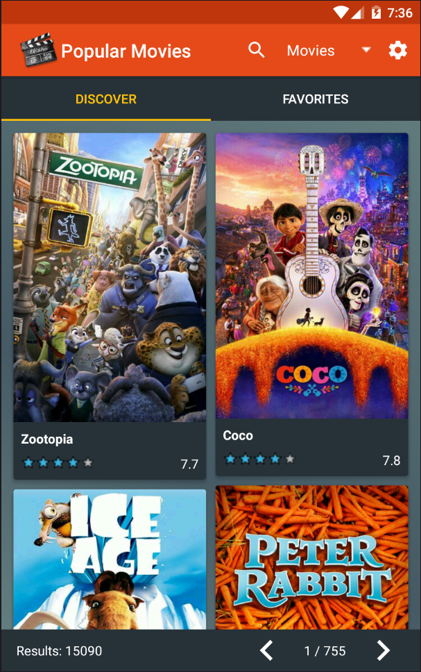
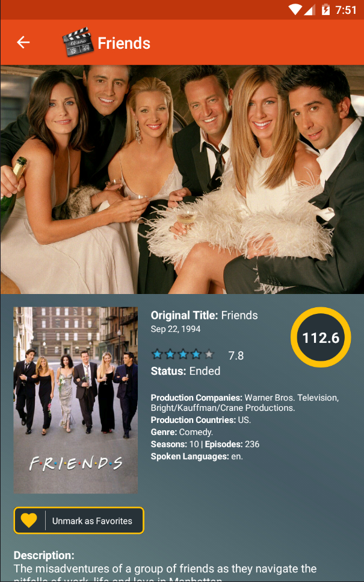
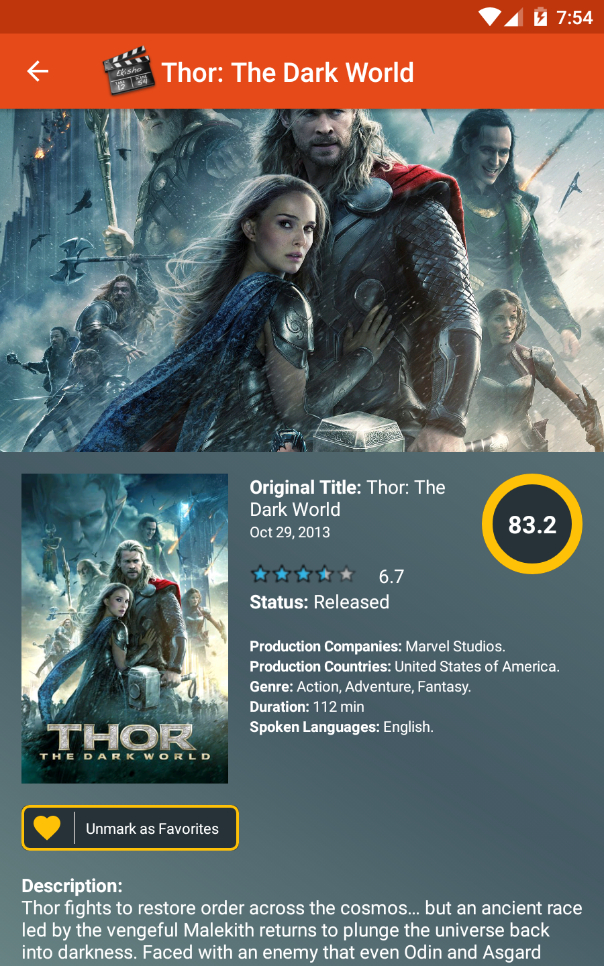
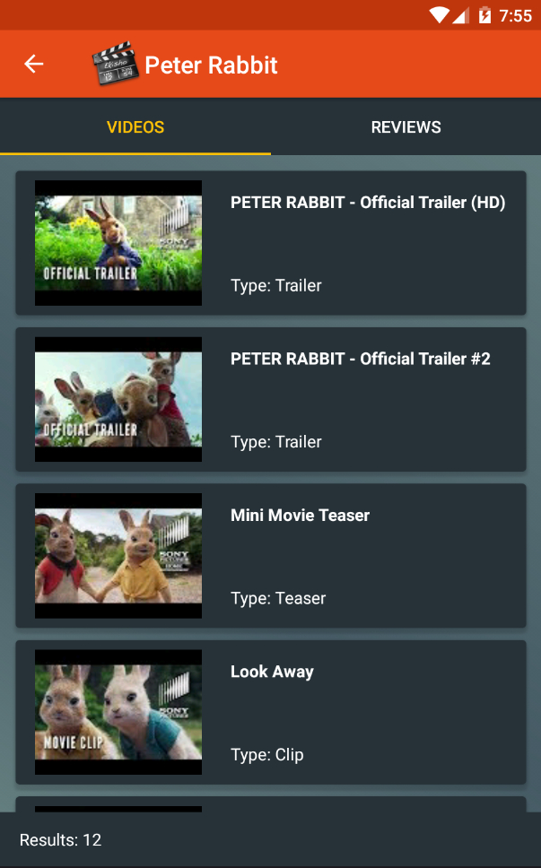

# PopularMovies

App created for Udacity.com in the course: Google Challenge Scholarship: Android Developer Nanodegree Program
 
<i>Skill level</i>: <b>intermediate</b>

This app implements a recyclerView and viewHolder of a list of pictures fetched via an HTTP request from <a href="https://www.themoviedb.org/" rel="nofollow">themoviedb.org</a> 
and also includes: 

<ul>
<li>A searcView on the actionBar with the instant search.</li>
<li>An advanced search to filter the results for movies and tv shows.</li>
<li>The image are displayed using the Image Loader Library <a href="https://github.com/bumptech/glide">Glide</a>, which it handles image loading/caching.</li>
<li>The favorites are store in a SQLite database exposed via a ContentProvider</li>
</ul>

The API Key is not included in the project. If you wish try this app, create a res/values/secrets.xml file in your resources as explained in the guide <a href="https://github.com/codepath/android_guides/wiki/Storing-Secret-Keys-in-Android">"Storing Secret Keys in Android"</a> and then add the following lines:

<pre>
&lt;resources&gt;
    &lt;string name="api_key"&gt;your_api_key&lt;/string&gt;
&lt;/resources&gt;
</pre>

Here some screenshots:

  
  
  
  

